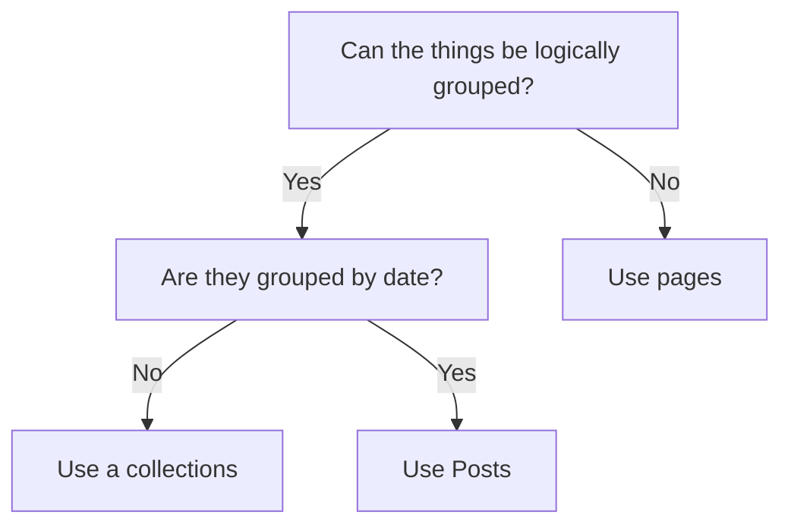
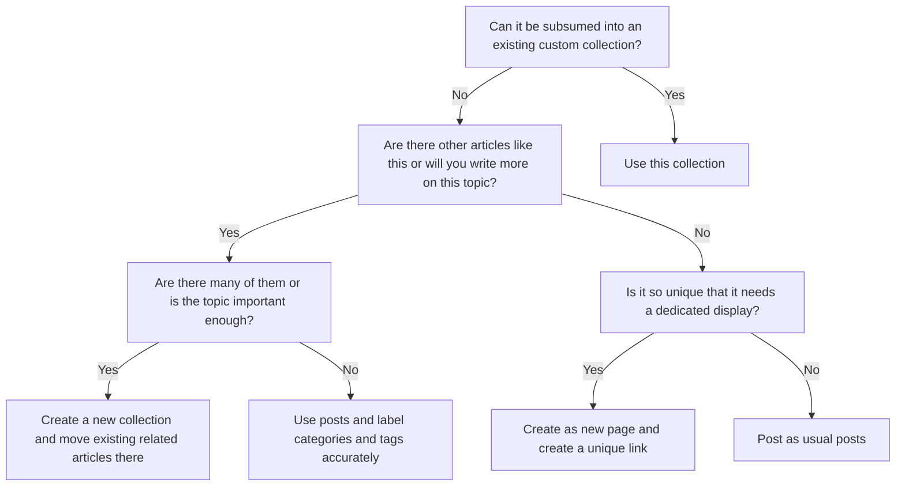

Collections are units for Jekyll to manage pages. Pages under the same collection are generally stored in the same folder, and Front Matter default values can be set uniformly in `_config.yml`. In addition, Jekyll will also create a traversal list for the pages in the collection to facilitate the writing of index pages, etc.

`posts` is a collection provided by Jekyll by default. In addition, `pages` that do not belong to other collections can also be regarded as a collection.

Here is some official documentation about collections:

* [Jekyll DOCS: Collections](https://jekyllrb.com/docs/collections/)
* [Minimal Mistakes DOCS: Working with Collections](https://mmistakes.github.io/minimal-mistakes/docs/collections/)

## Create Collections

Collections need to be defined in `_config.yml`. Collections can be defined by enumerating the names of collections in the variable `collections`. You can also write each definition of a collection into a dictionary, and the key-value pairs in the dictionary will set the properties of the collection.

For example:

```yml
collections:
  knowledge-taxonomy:
    output: true
    permalink: /:collection/:path/
  zz-ci:
    output: true
    permalink: /:collection/:path/
  zz-shi:
    output: true
    permalink: /:collection/:path/
  zz-zi:
    output: true
    permalink: /:collection/:path/
  zz-yi:
    output: true
    permalink: /:collection/:path/
```

Here, `knowledge-taxonomy`, `zz-ci` and `zz-shi` etc. are collections. `output: true` make pages in the collection visible. If this item is set to `false`, the corresponding web page will not be generated.

`permalink` set the access path of pages in the collection. The `:collection` means the name of the collection and the `:path` means the relative path of the page in the collection. For more about the grammar of values of `permalink`, refer to [Jekyll DOCS: Permalinks](https://jekyllrb.com/docs/permalinks/).

After setting in the `_config.yml`. You need create a folder for your collection. The folder name is your collection name preceded by `_`. Pages in this folder are regard as the members of the collection.

## Default Front Matter Values

After creating a collection, you can set the default values of Front Matter for pages in the collection. The setting method is similar to posts. The newly created collection needs to correspond to a new `defaults` entry, and the name of the collection is specified in the `scope` item.

A `defaults` with default values for `posts` and `knowledge-taxonomy` would look like this:

```yml
defaults:
  # posts
  - 
    scope:
      path: ""
      type: posts
    values:
      category: Uncategorized
      layout: single
      author_profile: true
      show_date: true    
      read_time: true
      share: true
      related: true
      toc: true
  # knowledge-taxonomy
  - 
    scope:
      path: ""
      type: knowledge-taxonomy
    values:
      layout: single
      author_profile: true
      show_date: true
      read_time: true
      share: true
      related: true
      toc: true
```

## Generate Index Pages for Collections

You can also create index page for each collection. Minimal Mistakes provides a dedicated layout `collection` for this purpose. Create a page, use `collection` layout and specify the collection name in the `collection` variable of Front Matter, and you will get the index page of this collection. For example:

```markdown
---
layout: collection
title: "Knowledge Taxonomy"
collection: knowledge-taxonomy
permalink: /knowledge-taxonomy/
---

Documents listing for the collection `_knowledge-taxonomy`.
```

You can also list all the collections in one page. For example, this is a Liquid fragment to list all the collections and their members.

```HTML

Pages in collections:


<h2>{{collection.label}}<h2>

  <h2>
    <a href="{{ item.url }}">
      {{ item.title }}
    </a>
  </h2>



```

If you don't want to include the posts collection, use this:

```HTML

Pages in collections:



<h2>{{collection.label}}<h2>

  <h2>
    <a href="{{ item.url }}">
      {{ item.title }}
    </a>
  </h2>



```

## Usage Advices of Collections

According the advice from this article [Jekyll Collections: What Collections Are](https://jekyll-one-org.github.io/pages/public/learn/bookshelf/jekyll_collections/), you can use collections to group together articles that are logically related but whose writing time is not important.

There is a very clear illustration in the article, which is reproduced in mermaid syntax as follows:



But in my opinion, logical classification is still more important than the writing date, so I recommend following this process to make decisions for a new article:


